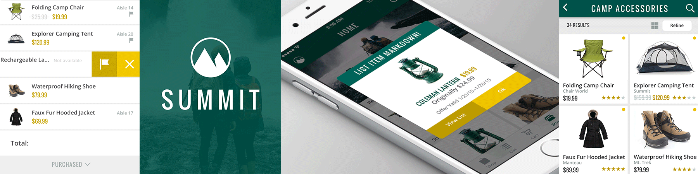

# IBM-Ready-App-for-Retail
 

### Overview
IBM Ready App for Retail is the second of the IBM ReadyApp Series. This app
* reshapes the specialty retail shopping experience
* personalizes this experience through direct communication
* understands consumer behavior in the context of the customer's journey
* focuses on real time personalization and engagement

### IBM Products

IBM Ready App for Retail is made great via

* [**IBM MobileFirst Platform**](http://www-03.ibm.com/software/products/en/mobilefirstplatform)
* [**IBM Bluemix**](https://console.ng.bluemix.net/)
  * [**Cloudant**] (https://cloudant.com/)
* [**IBM Mobile Push Notification, formerly Xtify Mobile Push Notification**] (http://www-03.ibm.com/software/products/en/mobile-push-notification)
* [**Estimote Beacons**] (http://estimote.com/)

### Getting Started
Please visit the [Getting Started page](http://lexdcy040194.ecloud.edst.ibm.com/summit_1_1_0/getting_started) to set up the project. 

### Documentation
Please visit [this page](http://lexdcy040194.ecloud.edst.ibm.com/summit_1_1_0/home) for access to the full documentation.

### License
IBM Ready App for Retail is available under the IBM Ready Apps License Agreement. See the [License file](https://github.com/IBM-MIL/IBM-Ready-App-for-Retail/blob/master/License.txt) for more details.

